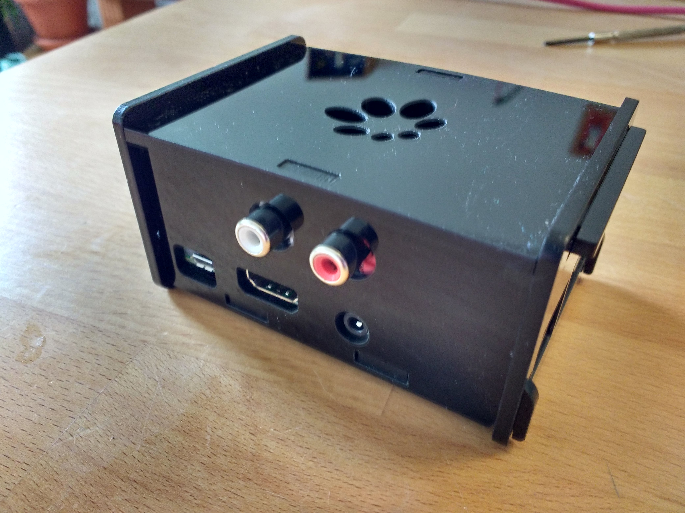
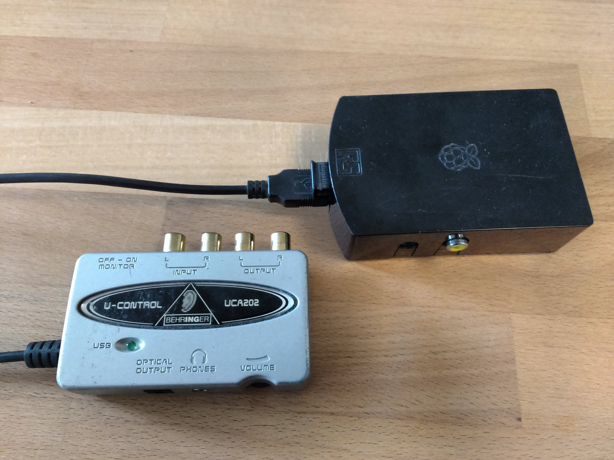
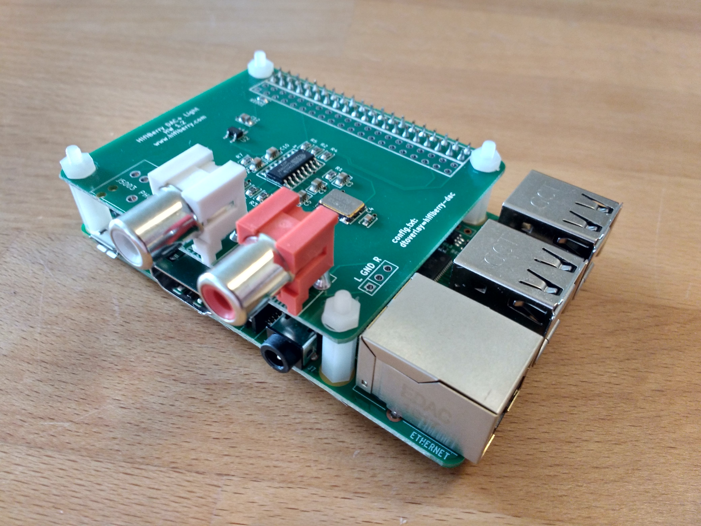
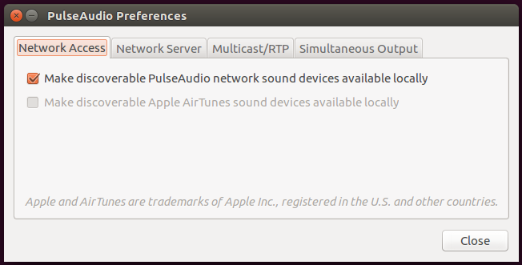
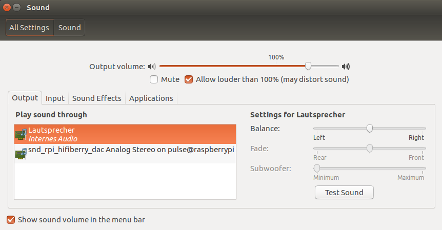

# Raspberry Pi Audio Streaming Box

This project explains how to setup a audio receiver box using a Raspberry Pi which allows to stream audio from

1. PulseAudio clients on the network or/and
1. a Bluetooth device (e.g. smartphone) via A2DP protocol

to your stereo hi-fi system.

Schematics:
```
+-------------------+                +-------------------------------+             +---------------------+
|                   |  Local network |               ||              |             |                     |
| PulseAudio Client | +------------->+               ||              |             |                     |
|                   |                |               ||              |             |                     |
+-------------------+                |               ||  HifiBerry   |             |                     |
                                     |  Raspberry Pi ||              | Cinch/SPDIF | Stereo Hi-Fi system |
+-------------------+                |               ||  or other    +------------->                     |
|                   |  Bluetooth A2DP|               || sound output |             |                     |
|  Bluetooth Device | +------------->+               ||              |             |                     |
|                   |                |               ||              |             |                     |
+-------------------+                +-------------------------------+             +---------------------+
```



## Hardware

In the following guide we will use a Raspberry Pi 3 Model B and a HifiBerry DAC+ Light, but the instructions should work the same with differnt Raspberry Pi models starting from Raspberry Pi 1, with other HifiBerry modules, e.g. HifiBerry Digi+ with digital output or even with external USB sound devices. Because of the terrible sound quality of Raspberry's onboard sound, I would strongly recommend against using it for Hi-fi output. The instructions should still apply, though.

The following table shows the products I used and which can be ordered as a bundle from the [HifiBerry shop](https://www.hifiberry.com/shop/) from Switzerland.

| Article                                         	| Price   	  |
|-------------------------------------------------	|-----------	|
| Raspberry Pi 3 Model B                          	| € 31,90    	|
| HifiBerry DAC+ Light                            	| € 19,90  	  |
| HifiBerry universal case                        	| € 9,90   	  |
| microSD card 8GB, class 10                      	| € 5,90     	|
| Power supply                                    	| € 9,90   	  |
| Shipping via registered mail                    	| € 15,00  	  |
| import sales tax 19% (when shipping to Germany) 	| € 17,58  	  |
|-------------------------------------------------	|------------ |
| **Total**                                        	| **€ 110,08**|

Of course you can re-use existing components. Instead of a HifiBerry you can also use an external USB sound adapter with a high quality digital-analog converter (DAC) like the [*Behringer U-Control UCA222*](http://www.music-group.com/Categories/Behringer/Computer-Audio/Audio-Interfaces/UCA222/p/P0A31) (about € 30). Notice that only the Raspberry Pi 3 has a built-in bluetooth module. In case you want to use a Raspberry Pi 1 or 2, you need to get a USB bluetooth dongle. I can recommend the [*Plugable USB 2.0 Bluetooth Adapter*](http://plugable.com/products/usb-bt4le) (€ 17).



## Setup

### Setup Raspbian

This guide uses Raspbian Lite as operating system for the Raspberry Pi. You will have to [download](https://www.raspberrypi.org/downloads/raspbian/) and [install](https://www.raspberrypi.org/documentation/installation/installing-images/README.md) according to the documentation to your micro SD card. I successfully tested the image `2016-05-27-raspian-jessie-lite.img`.

Now put the microSD card into the Raspberry and assemble the hardware. If you use the HifiBerry together with the HifiBerry case, you have to install the spacers that came with it. It is important to put the part with the bolt nut to the top side of the HifiBerry (see following picture), otherwise it won't fit into the case ;-)



After connecting the Pi to the network, power and your hi-fi equipment, it will boot up and you can log into it using SSH. Default hostname is `raspberrypi`, user `pi` and password `raspberry`.

You should first perform an update to the latest packages and reboot:
```bash
pi@raspberrypi:~ $  sudo apt-get update && sudo apt-get dist-upgrade && sudo reboot
```

### Setup HifiBerry

Unfortunately as of 2016-08-21, the HifiBerry wont' work out-of-the box using the latest Raspbian kernel available in the stable repositories. Therefore you have to upgrade it manually to the latest unstable version, which is actually quite simple using `rpi-update`:
```bash
pi@raspberrypi:~ $ sudo apt-get install rpi-update && sudo rpi-update
```

I sucessfully tested this setup with the following Firmware revision:
```bash
pi@raspberrypi:~/raspberrypi-audio $ cat /boot/.firmware_revision
9e8f2d6f0c5afd54ab2018c7634785941f04ef91
```

Because you probably wont' be using the onboard sound anymore, you can disable it by commenting the line `dtparam=audio=on` in `/boot/config.txt`:
```
# Enable audio (loads snd_bcm2835)
#dtparam=audio=on
```

To enable the HifiBerry driver, also add the following line to `/boot/config.txt`:
```
dtoverlay=hifiberry-dac
```

Now create the file `/etc/asound.conf` with the following content:
```
pcm.!default  {
 type hw card 0
}
ctl.!default {
 type hw card 0
}
```

Finally reboot (`sudo reboot`) and verify the HifiBerry is present as sound device:

```bash
pi@raspberrypi:~ $ aplay -l
**** List of PLAYBACK Hardware Devices ****
card 0: sndrpihifiberry [snd_rpi_hifiberry_dac], device 0: HifiBerry DAC HiFi pcm5102a-hifi-0 []
  Subdevices: 1/1
  Subdevice #0: subdevice #0
```

### Setup PulseAudio network straming and publishing via Zeroconf

In order to be able to stream audio from PulseAudio clients on the network to the Pi, you first have to install the necessary packages:

```bash
pi@raspberrypi:~ $ sudo apt-get install --no-install-recommends pulseaudio pulseaudio-module-zeroconf
```

We will run PulseAudio in *system mode* and will handle it's execution via systemd. Therefore we create the systemd unit file in `/etc/systemd/system/pulseaudio.service`:

```
[Unit]
Description=PulseAudio Daemon
After=sound.target

[Service]
PrivateTmp=true
ExecStart=/usr/bin/pulseaudio --system --realtime --disallow-exit --no-cpu-limit
Restart=always

[Install]
WantedBy=multi-user.target
```

Then enable it, so it automatically runs on system startup:
```bash
pi@raspberrypi:~ $ sudo systemctl enable pulseaudio.service`
```

We also need to add some permissions:
```bash
sudo usermod -a -G audio pulse
sudo usermod -a -G pulse-access pi
sudo usermod -a -G pulse-access root
```

In order to enable the network streaming and service anouncement via Zeroconf, load the required modules in `/etc/pulse/system.pa`:
```
load-module module-native-protocol-tcp auth-anonymous=1
load-module module-zeroconf-publish
```

I had some crackling sounds which I was able to fix by adding `tsched=0` as argument to the `udev-detect` module  in `/etc/pulse/system.pa`:
```
load-module module-udev-detect tsched=0
```

Start PulseAudio:
```bash
pi@raspberrypi:~ $ sudo systemctl start pulseaudio.service
```

On your other computers on the network you need to configure PulseAudio to show output devices on the network. The easiest  way ist to use the program `paprefs`, e.g. on Ubuntu:

```bash
user@ubuntu:~ $ sudo apt-get install paprefs
user@ubuntu:~ $ $ paprefs
```



You should now see the HifiBerry as a PulseAudio sink on your other computers in the same network using `pavucontrol` or `unity-control-center sound`:




If you have the sound device twice on your PulseAudio clients this is because Zeroconf seems to publish it via IPv4 and IPv6 simultaneously. So you can get rid of the duplicates by disabling one of the both in `/etc/avahi/avahi-daemon.conf` (in this case I prefer IPv6 over IPv4):
```
use-ipv6=yes
use-ipv4=no
```

To apply the change, restart the Avahi daemon:
```bash
pi@raspberrypi:~ $ sudo systemctl restart avahi-daemon
```

### Setup PulseAudio Bluetooth A2DP target

This part will setup Bluetooth and PulseAudio on your Pi so you can stream music from your smartphone (or other Bluetooth A2DP sources) to your hi-fi system.

Install packages needed for PulseAudio's bluetooth support:

```bash
pi@raspberrypi:~ $ sudo apt-get install --no-install-recommends pulseaudio-module-bluetooth
```

Enable the bluetooth modules by adding the following two lines to `/etc/pulse/system.pa`:
```
load-module module-bluetooth-policy
load-module module-bluetooth-discover
```

Create the file `/etc/bluetooth/audio.conf` with the following content:
```
[General]
Class = 0x20041C
Enable = Source,Sink,Media,Socket
```

Set `Name` and `Class` in `/etc/bluetooth/main.conf`:
```
[General]
...
Name = raspberrypi
Class = 0x20041C
...
```

Now Reboot (`sudo reboot`). Next you have to pair the Bluetooth devices:

Turn on Bluetooth on your smartphone and make it discoverable. Then on the Pi:
```
pi@raspberrypi:~ $ bluetoothctl
[NEW] Controller B8:27:EB:39:FB:71 raspberrypi [default]
[bluetooth]# agent on
[bluetooth]# default-agent
[bluetooth]# discoverable on
[bluetooth]# scan on
```

After some seconds the bluetooth devices nearby should be displayed. Now for each device you want to pair:
```
pair XX:XX:XX:XX:XX:XX
...
trust XX:XX:XX:XX:XX:XX
```

In order to automatically connect to the Bluetooth devices and to link this bluetooth source to the PulseAudio sink, we need a little helper script. Add the script [a2dp-autoconnect](usr/local/bin/a2dp-autoconnect) to `/usr/local/bin` and make it executable:

```bash
pi@raspberrypi:~ $ sudo chmod +x /usr/local/bin/a2dp-connect
```

Furthermore, we need a udev rule. Create the file `/etc/udev/rules.d/99-input.rules` with the following content:
```
KERNEL=="input[0-9]*", RUN+="/usr/local/bin/a2dp-autoconnect"
```

That's it! Now you should be able to connect your bluetooth devices and stream audio to your stereo :-)

## Overview of added or modified files

**Avahi**:
* [/etc/avahi/avahi-daemon.conf](etc/avahi/avahi-daemon.conf)

**Bluetooth**
* [/etc/bluetooth/main.conf](/etc/bluetooth/audio.conf)
* [/etc/bluetooth/audio.conf](etc/bluetooth/audio.conf)

**Pulseaudio**
* [/etc/pulse/system.pa](etc/pulse/system.pa)

**Systemd**
* [/etc/systemd/system/pulseaudio.service](etc/systemd/system/pulseaudio.service)

**udev**
* [/etc/udev/rules.d/99-input.rules](etc/udev/rules.d/99-input.rules)
* [/usr/local/bin/a2dp-autoconnect](usr/local/bin/a2dp-autoconnect)

## Sources
* https://www.hifiberry.com/guides/updating-the-linux-kernel/
* https://www.hifiberry.com/guides/configuring-linux-3-18-x/
* https://gist.github.com/oleq/24e09112b07464acbda1#setup-pulseaudio
* https://possiblelossofprecision.net/?p=1956
* https://informatik.zone/hi-fi-mit-raspberry-pi-hifiberry-dac-und-pulseaudio/
* https://wiki.archlinux.org/index.php/PulseAudio/Troubleshooting#Glitches.2C_skips_or_crackling
